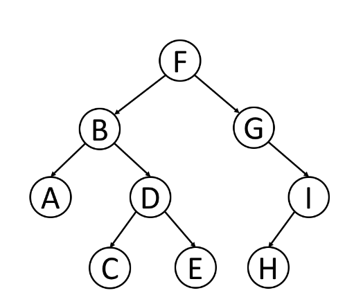
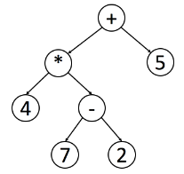

# 树
## 树的遍历


先序遍历：根--左--右  如：F-B-A-D-C-E-G-I-H

中序遍历：左--根--右  如：A-B-C-D-E-F-G-H-I

后序遍历：左--右--根  如：A-C-E-D-B-H-I-G-F

通常来说，对于二叉搜索树，可以通过中序遍历得到一个递增的有序序列。

当你删除树中的节点时，删除过程将按照后序遍历的顺序进行。



用中序遍历能找到原始的表达式，但是对树进行后序遍历，再用栈来处理表达式更容易。每次遇到一个操作符，就从栈中取出两个元素，并将计算结果返回栈中。
树的层序遍历：逐层遍历数结构，类似于广度优先搜索。通常使用队列来做广度优先搜素。

## 用递归的思想来解决树的问题
自顶向下的解决方法：首先访问节点来计算一些值，并在递归调用函数的饿时候将这些值传递到子节点，可以认为自顶向下是一种前序遍历。

原理：
```
return specific value for null node
update the answer if needed                      // answer <-- params
left_ans = top_down(root.left, left_params)		// left_params <-- root.val, params
right_ans = top_down(root.right, right_params)	// right_params <-- root.val, params
return the answer if needed                      // answer <-- left_ans, right_ans
```
例如：找二叉树的最大深度，伪代码：
```
return if root is null
if root is a leaf node:
 		answer = max(answer, depth)         // update the answer if needed
maximum_depth(root.left, depth + 1)      // call the function recursively for left child
maximum_depth(root.right, depth + 1)		// call the function recursively for right child
```
代码：
```
private int answer;		// don't forget to initialize answer before call maximum_depth
private void maximum_depth(TreeNode root, int depth) {
    if (root == null) return;
    if (root.left == null && root.right == null) {
        answer = Math.max(answer, depth);
    }
    maximum_depth(root.left, depth + 1);
    maximum_depth(root.right, depth + 1);
}
```
自底向上的解决方法：首先对所有子节点递归调用函数，然后根据返回值和根节点本身的值得到答案，可以看做是一种后序遍历。

原理：
```
return specific value for null node
left_ans = bottom_up(root.left)			// call function recursively for left child
right_ans = bottom_up(root.right)		// call function recursively for right child
return answers                           // answer <-- left_ans, right_ans, root.val
```
代码：
```
public int maximum_depth(TreeNode root) {
	if (root == null) {
		return 0;                                   // return 0 for null node
	}
	int left_depth = maximum_depth(root.left);
	int right_depth = maximum_depth(root.right);
	return Math.max(left_depth, right_depth) + 1;	// return depth of the subtree rooted at root
}
```
总结：如果能确定一些参数，从该节点自身解决出发寻找答案并且可以使用这些参数和节点本身的值来决定什么应该传递给它的子节点的参数，就可以使用自顶向下的递归来解决此问题；如果对于树中任意的一个节点，你知道它子节点的答案，你能计算出该节点的答案，那可以使用自底向上的递归。

快速排序和归并排序也和二叉树的遍历有关系，快速排序可以看做二叉树的前序排序，归并排序可以看做一个二叉树的后序遍历。

二叉树的关键是写递归方法，写递归算法的关键是要明确函数的“定义”是什么，然后相信这个定义，利用这个定义推导最终结果，绝对不要试图跳入递归。写树相关的算法就是先搞清楚当前root节点该做什么，然后根据函数定义递归调用子节点，递归调用会让子节点做相同的事情。

## 例如：[LeetCode P101 对称二叉树](https://leetcode-cn.com/problems/symmetric-tree/)

思路：判断一要判断一个二叉树是不是对称的，只有左右子树的对称的值相等，如果左右子树又一边为空，另一边不为空，或左子树的右节点！=右子树的左节点，左子树的左节点！=右子树的右节点则说明不对称。所以写递归的时候，可以写回溯条件是左右子树为空或者那两个不相等的条件。
```
public boolean isSymmetric(TreeNode root) {
        if(root==null) {
            return true;
        }
        //调用递归函数，比较左节点，右节点
        return dfs(root.left,root.right);
    }
    boolean dfs(TreeNode left, TreeNode right) {
        //递归的终止条件是两个节点都为空
        //或者两个节点中有一个为空
        //或者两个节点的值不相等
        if(left==null && right==null) {
            return true;
        }
        if(left==null || right==null) {
            return false;
        }
        if(left.val!=right.val) {
            return false;
        }
        //再递归的比较 左节点的左孩子 和 右节点的右孩子
        //以及比较  左节点的右孩子 和 右节点的左孩子
        return dfs(left.left,right.right) && dfs(left.right,right.left);
    }
```

## 例如：翻转二叉树，将整棵树镜像翻转
思路：将二叉树上的每一个节点的左右子节点进行交换，最后的结果就是完全翻转之后的二叉树，因为是先进行交换，然后再进行接着遍历，所以我们可以用先序遍历，也可以用后序遍历，但是中序遍历不行。
```
if(root == null) return null;
TreeNode temp;
temp = root.left;
root.left = root.right;
root.right = temp;
invertTree(root.left);
invertTree(root.right);
return root;
```
二叉树题目的一个难点就是如何把题目的要求细化成每一个节点需要做的事。

## 例如：[LeetCode P116 填充每个节点的下一个右侧节点指针](https://leetcode-cn.com/problems/populating-next-right-pointers-in-each-node/)
思路：可以用BFS遍历出每一层的节点的值，然后在后面加上一个‘#’，结果行不通。二叉树的难点在于如何把题目的要求细化成每个节点需要做的事情。这个题目只用一个节点是无法连接跨父节点的两个相邻节点的，所以我们需要用两个节点，将每一层二叉树节点连接起来细化成将每两个相邻节点都连接起来。

1.用层序遍历的方法。
```
if (root == null) return root;
// 初始化队列同时将第一层节点加入队列中，即根节点
Queue<Node> queue = new LinkedList<Node>(); 
queue.add(root);
// 外层的 while 循环迭代的是层数
while (!queue.isEmpty()) {
      // 记录当前队列大小
      int size = queue.size();
      // 遍历这一层的所有节点
      for (int i = 0; i < size; i++) {
      // 从队首取出元素
      Node node = queue.poll();
       // 连接
      if (i < size - 1) {
            node.next = queue.peek();
      }
      // 拓展下一层节点
      if (node.left != null) {
            queue.add(node.left);
      }
      if (node.right != null) {
           queue.add(node.right);
      }
   }
}
      return root; // 返回根节点
```

2.用两个节点来连接两个相邻节点
```
public Node connect(Node root) {
        if (root == null) return null;
        connectTwoNode(root.left, root.right);
        return root;
    }
    public void connectTwoNode(Node node1, Node node2) {
        if (node1 == null || node2 == null) return;
    /**** 前序遍历位置 ****/
    // 将传入的两个节点连接
        node1.next = node2;
    // 连接相同父节点的两个子节点
        connectTwoNode(node1.left, node1.right);
        connectTwoNode(node2.left, node2.right);
    // 连接跨越父节点的两个子节点
        connectTwoNode(node1.right, node2.left);
    }
```

## 例如：[LeetCode P114将二叉树展开为链表](https://leetcode-cn.com/problems/flatten-binary-tree-to-linked-list/)
思路：将一个二叉树展开成链表，且顺序为先序遍历的顺序。考虑将左右子树拉平，拉平的方法是将右子树接到左子树的下方，然后将整个左子树作为右子树。
```
if (root == null) return;
flatten(root.left);
flatten(root.right);
TreeNode left = root.left;
TreeNode right = root.right;
root.right = left;
root.left = null;      
TreeNode p = root;
while (p.right != null) {
     p = p.right;
}
p.right = right;
```
总结：递归算法的关键要明确函数的定义，相信这个定义，而不要跳进递归的细节。写二叉树的算法题，都可以基于递归框架的，做题时我们要先搞清楚root节点它自己要做什么，然后根据题目要求选择使用前序，中序，后序的递归框架。二叉树的题目难点在于如何通过题目的要求思考出每一个节点需要什么。

## 例如：[LeetCode P654 最大二叉树](https://leetcode-cn.com/problems/maximum-binary-tree/)
思路：首先找到数组中最大的值，然后把它设置为根节点，然后用递归将最大值前面的数组和后面的数组分别传递给下一个节点构造左右子树，并且同时传递low和high指针。
```
public TreeNode constructMaximumBinaryTree(int[] nums) {
        if(nums.length == 0) return null;
        return build(nums,0,nums.length-1);
    }
    public TreeNode build (int[] nums,int low,int high){
        if(low > high) return null;
        int max = Integer.MIN_VALUE;
        int index = -1;
        for(int i=low ; i<=high ; i++){
            if (max < nums[i]){
                max = nums[i];
                index = i;
            }
        }
        TreeNode root = new TreeNode(max);
        root.left = build(nums,low,index-1);
        root.right = build(nums,index+1,high);
        return root;
    }
```

## 例如：[LeetCode P105 通过前序和中序遍历构造二叉树](https://leetcode-cn.com/problems/construct-binary-tree-from-preorder-and-inorder-traversal/)
思路：先知道先序遍历和中序遍历的特点，先序遍历产生的数组的第一个就是根节点，中序遍历中根节点前面的是左子树，后面的是右子树。左右子树也是这个规律。然后找到位置的关系：左子树的长度=index-instart。
```
public TreeNode buildTree(int[] preorder, int[] inorder) {
        if(preorder.length ==0 || inorder.length ==0) return null;
        return build(preorder,0,preorder.length-1,inorder,0,inorder.length);
    }

    public TreeNode build(int[] preorder,int prelow,int perhigh,int[] inorder,int inolow,int inohigh){
        if(prelow > perhigh) return null;
        int rootval = preorder[prelow];
        int index = 0;
        for(int i=inolow ; i<=inohigh ; i++){
            if(inorder[i] == rootval){
                index = i;
                break;
            }
        }
        int leftsize = index - inolow;
        TreeNode root = new TreeNode(rootval);
        root.left = build(preorder,prelow+1,prelow+leftsize,inorder,inolow,index-1);
        root.right = build(preorder,prelow+leftsize+1,perhigh,inorder,index+1,inohigh);
        return root;
    }
 ```
## 总结
做而二叉树的问题，关键是把题目的要求细化，搞清楚根节点应该做什么，然后剩下的事情抛给前中后序遍历框架。


##例如：[LeetCode P652 寻找重复的子树](https://leetcode-cn.com/problems/find-duplicate-subtrees/)
思路：要想寻找重复的子树，就要先知道这个节点后的树是什么样子的，可以用先序或后序遍历并通过拼接字符串的方式把二叉树序列化，不能使用中序遍历，因为使用中序遍历可能会使遍历出来的不同子树的序列化字符串相同。然后将树 的所有子树的可能都遍历出来，然后比较，就能知道有没有重复的子树。用hashmap来存储遍历出来的所有子树。
```
HashMap<String, Integer> memo = new HashMap<>();
// 记录重复的子树根节点
LinkedList<TreeNode> res = new LinkedList<>();
/* 主函数 */
List<TreeNode> findDuplicateSubtrees(TreeNode root) {
traverse(root);
return res;
}
/* 辅助函数 */
String traverse(TreeNode root) {
if (root == null) {
return "#";
}
String left = traverse(root.left);
String right = traverse(root.right);
String subTree = left + "," + right+ "," + root.val;
int freq = memo.getOrDefault(subTree, 0);
// 多次重复也只会被加入结果集一次
if (freq == 1) {
res.add(root);
}
// 给子树对应的出现次数加一
memo.put(subTree, freq + 1);
return subTree;
}
```
